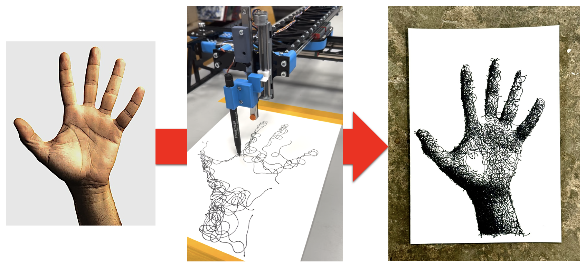
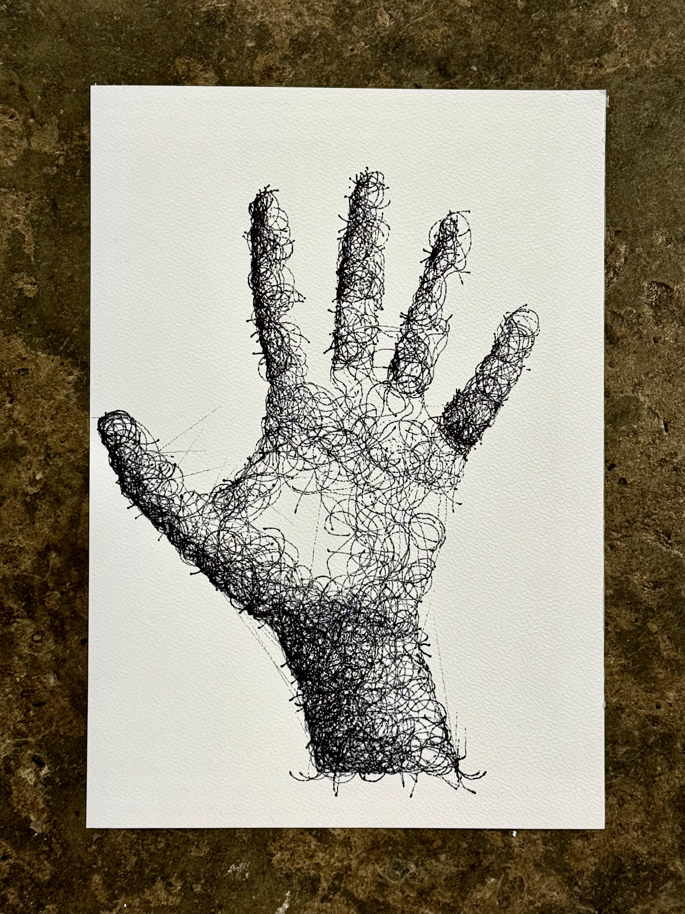
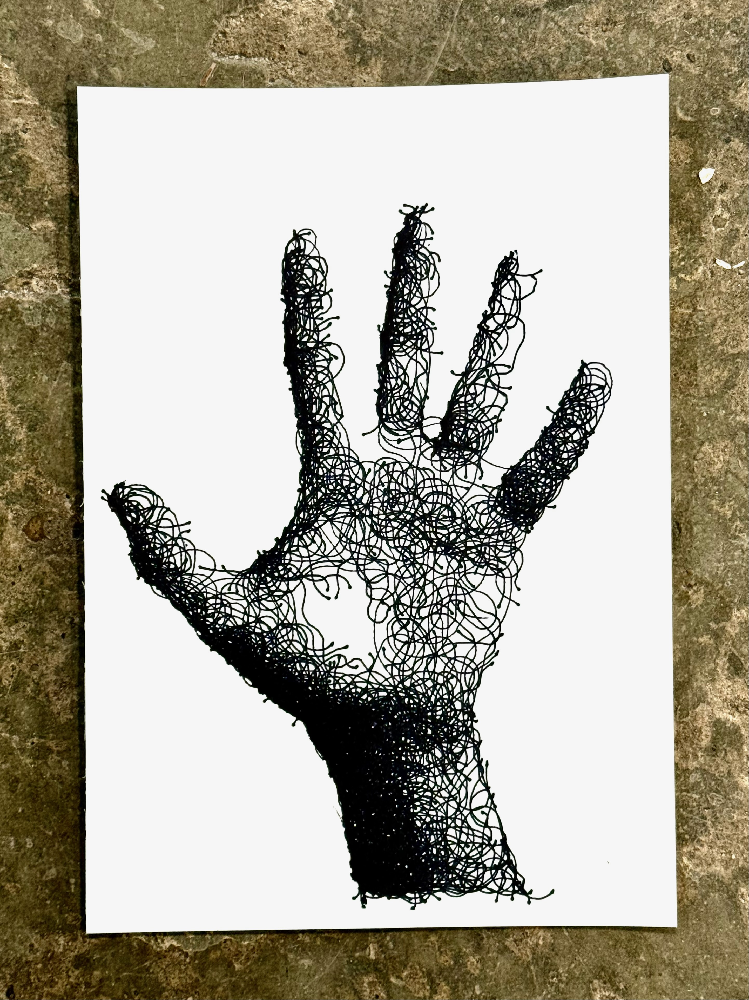
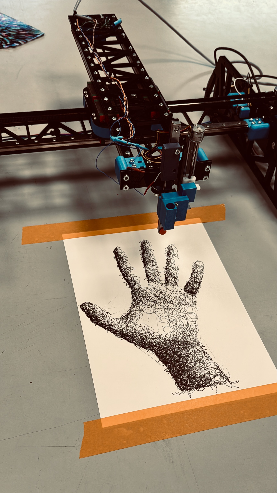

# PlotBotStudio

PlotBot Studio transforms your images into beautifully detailed pen-drawings, capturing every nuance with precision and artistic flair. Using sophisticated algorithms, it converts images into a series of continuous lines and arcs, perfect for plotting with mechanical plotters or CNC machines.



## Features

- Convert images to continuous line drawings
- Real-time visualization of drawing process
- Support for GRBL-based plotters via serial connection
- G-code generation with arc support (G2/G3 commands)
- Configurable drawing parameters
- Optional video recording of drawing process

## Installation

1. Create and activate a virtual environment:
```bash
python -m venv venv
source venv/bin/activate  # On macOS/Linux
# or
.\venv\Scripts\activate  # On Windows
```

2. Install required dependencies:
```bash
pip install -r requirements.txt
```

## Usage

### Simulation Mode

To run in simulation mode (no plotter connection):

```bash
python plotbot.py Examples/ekster.png --plotter none
```

This will open a window showing the drawing process. Press ESC to stop the process.

### Direct Plotter Control

To send commands directly to a GRBL-based plotter:

```bash
python plotbot.py Examples/ekster.png --plotter serial
```

The program will automatically detect USB serial ports. You can specify a port in `config.yaml` if needed.

### Generating G-code

To generate G-code without connecting to a plotter:

```bash
python plotbot.py Examples/hand.jpg --plotter file --gcodefile output.gcode
```

This will create a G-code file that can be used later with your CNC machine or plotter.

### Recording Video

Add the `--record` flag to save a video of the drawing process:

```bash
python plotbot.py Examples/beetle.jpeg --record
```

## Configuration

All drawing parameters can be customized in `config.yaml`:

- Canvas dimensions
- Plotter settings (work area, feedrate, etc.)
- Drawing parameters (stroke thickness, segment lengths, etc.)
- Serial connection settings

## Example Outputs





## License

This project is licensed under the MIT License - see the [LICENSE](LICENSE) file for details.

